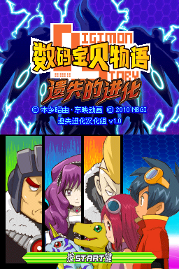
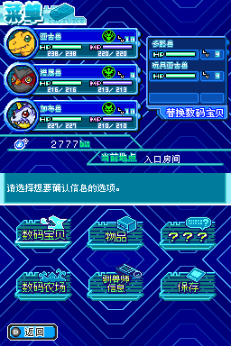

# 《数码宝贝物语 遗失的进化》汉化
## 汉化名单

**遗失进化汉化组** 汉化

- **破解**：Xzonn、卧看微尘、0xfadec
- **翻译**：无敌阿尔宙斯、遠い炎群、朝绯、新月、哒不溜、K40、宇宙パトロール
- **美工**：翼宿一、小光、楽、奕羽、卧看微尘、Xzonn
- **测试**：新月、无敌阿尔宙斯、喵提斯、darkwave

## 汉化说明

注：本汉化版与繁乐西的机翻汉化版本在 ROM、技术、程序、翻译、美工上均无任何关系，为另起炉灶之作。

本 ROM 在发布前经过认真测试，游戏中并未有在农场岛或特定场合死机的恶性 Bug，可以放心游玩。另外，按名字检索数码宝贝的功能也可正常使用，并可对应数码宝贝汉语拼音字母顺序进行排列。

取名部分无法对应中文输入法，敬请见谅，但可以使用主人公及数码宝贝们的默认中文名称。

由于本作在模拟器上游玩时修理数码板块的操作难度过高，特附上金手指列表，其中包含修复过程中耐久度和时间不会减少的代码，请酌情使用。

如要游玩游戏的联机功能，推荐使用 [melonDS 模拟器](https://github.com/melonDS-emu/melonDS>)。

## 使用方式

请自行获取游戏日文版 ROM，然后下载修正补丁并解压，按照补丁应用工具“NitroPatcher”的说明进行操作。补丁压缩包中包含了 Microsoft Windows 平台的补丁应用工具，其他平台的工具可通过下方下载地址获取。

日文版 ROM 校验码（[No-Intro](https://datomatic.no-intro.org/index.php?page=show_record&s=28&n=5056)）：

- CRC32：`83878137`
- MD5：`d994ff42e80827fd4546bb64ffd8d2ea`
- SHA-1：`f180146f517712c177d6497125a24f35b0d6102f`

修正补丁下载地址：

- GitHub：<https://github.com/Xzonn/DSLEChsLocalization/releases/download/v1.0.0/DSLEChsLocalization.v1.0.0.zip>
- 百度网盘：<https://pan.baidu.com/s/1EcsaAOXJmZmLZlY9aEWdXQ?pwd=dsle>

补丁应用工具下载地址：

- GitHub：<https://github.com/Xzonn/NitroPatcher/releases/latest/>
- 百度网盘：<https://pan.baidu.com/s/1vXynSX1WauU3FeGHDnrDfg?pwd=ntro>

## 截图预览

  

## 构建方式
### 前提条件

- [Python 3.10+](https://www.python.org/downloads/)（`pip install -r requirements.txt`）
- [PowerShell 5.0+](https://learn.microsoft.com/powershell/)
- [.NET 8.0 SDK](https://dotnet.microsoft.com/download/dotnet/8.0)、[dotnet-script](https://github.com/dotnet-script/dotnet-script)
- [devkitPro、devkitARM](https://devkitpro.org/wiki/Getting_Started)（`dkp-pacman -Sl nds-dev`）
- 字体文件（默认读取以下文件：`files/fonts/Zfull-GB.ttf`、`C:/Windows/Fonts/simsun.ttc`、`files/fonts/SmileySans-Oblique.otf`、`files/fonts/HYZongYiTiJF.ttf`）

### 构建
在 PowerShell 中运行：

```shell
. scripts\build_patch.ps1
```
